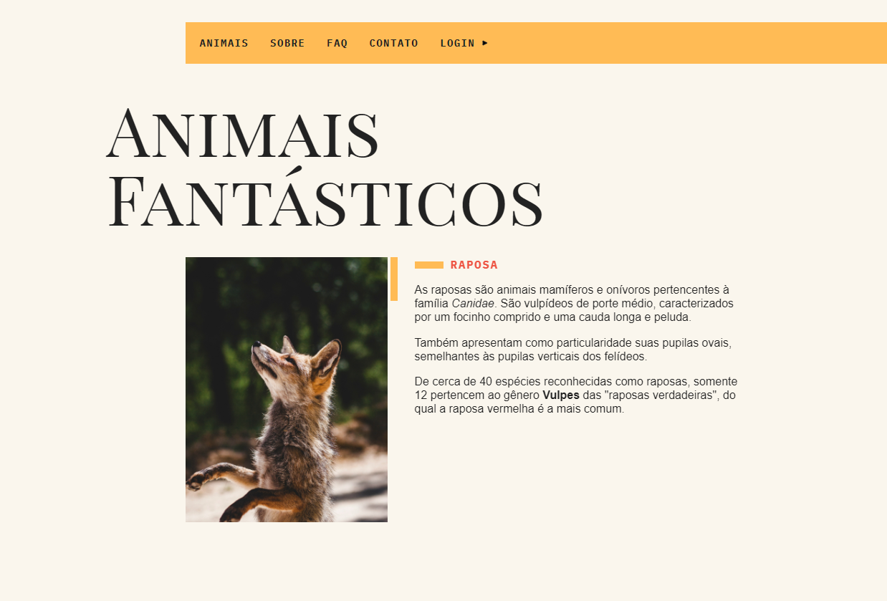

# animais-fantasticos

<h1 align="center">
    
</h1>

Site desenvolvido durante o curso de Javascript da Origamid.
No projeto foram abordados diversos conceitos de Javascript e suas aplicações para fornecer funcionalidade ao site.
Dentre as principais aplicações desenvolvidas temos:

- tabnav: navegação pelas imagens dos animais, fazendo com que apenas a descrição correspondente ao animal selecionado apareça no site;
- scroll: animação de entrada de acordo com o scroll da página;
- tooltip: criação de uma tooltip no mapa linkada com o evento de mouseover;
- accordion-list: criação de uma accordion list na seção de FAQ, com descrição aparecendo ao clique;
- dropdown-menu: criação de um menu que abre novas seções ao clique;
- modal: criação de um menu modal pro login que explorou o uso de funções para clique fora do elemento;
- fetch-animais e bitcoin: utilização de promises para puxar dados de api externas;

Fora isso, diversas aplicações foram estudadas e desenvolvidas durante o curso que podem ser adaptadas para outros projetos, como a parte de horário de atendimento que altera o estilo de acordo com o horário atual, validação de formulários utilizando regExp.
Reforçamos também o que foi aprendido em cursos anteriores para a criação do site (HTML e CSS).
